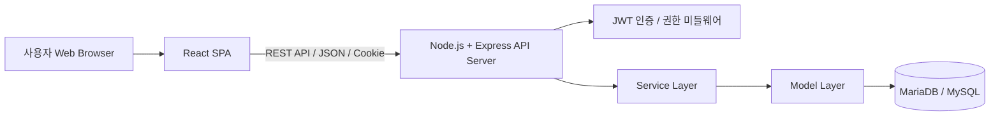
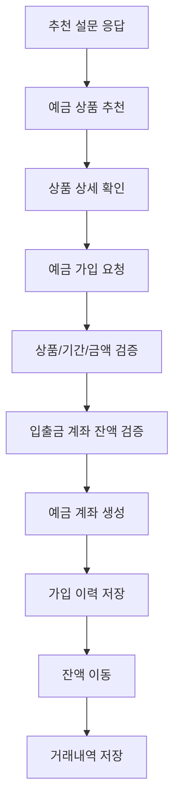
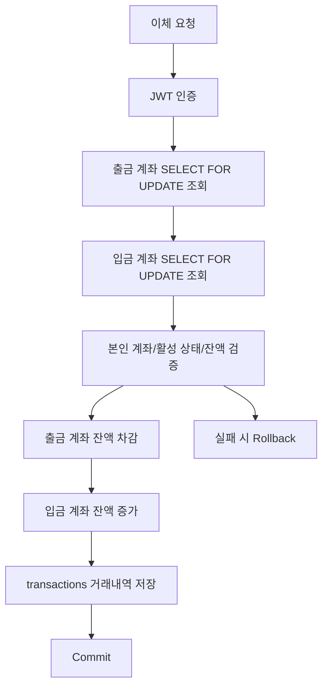
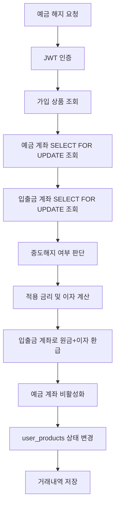

# 도토리뱅크 PPT 구성안 v2

> 목적: 발표 흐름 중심으로 재구성  
> 방향: 기획 배경 → 기술 구조 → 핵심 기능 → 시연 → 테스트/개선 → 자체 평가

## PPT AI 생성 지시문

- 이 Markdown 파일을 기반으로 발표용 PPT를 생성한다.
- 발표 주제는 "도토리뱅크: 사회초년생을 위한 맞춤형 예금 추천 금융 플랫폼"이다.
- 전체 흐름은 기획 배경 → 기술 구조 → 핵심 기능 → 시연 → 테스트/개선 → 자체 평가 순서로 구성한다.
- 한 슬라이드에는 핵심 문장 1개와 bullet 4~6개만 배치한다.
- 긴 문단은 슬라이드 본문에 모두 넣지 말고 발표자 노트 수준으로 요약한다.
- 표가 있는 부분은 깔끔한 테이블로 시각화한다.
- Mermaid 코드는 그대로 넣지 말고 PPT용 흐름도/파이프라인 다이어그램으로 변환한다.
- 색상은 금융 서비스 느낌의 안정적인 블루/화이트 계열을 중심으로 사용한다.
- 전체 디자인은 토스/핀테크 서비스처럼 깔끔하고 신뢰감 있는 톤으로 구성한다.
- 장식적인 요소보다 정보 구조, 가독성, 흐름 이해를 우선한다.
- 핵심 키워드는 굵게 강조한다.

### 발표에서 강조할 메시지

- 도토리뱅크는 단순 금융 화면이 아니라 추천 → 가입 → 잔액 이동 → 거래내역 저장까지 연결한 금융 MVP이다.
- 핵심 기능은 "추천 → 예금 가입 → 거래내역" 흐름이다.
- 금융 서비스의 신뢰성을 위해 서버 검증, DB Transaction, SELECT ... FOR UPDATE, Commit/Rollback, 거래내역 저장을 고려했다.
- 프론트엔드에서는 React Query, Zustand, useState를 상태 성격에 따라 분리했다.
- 백엔드는 routes, controllers, services, models, middlewares 계층으로 구성했다.
- 인증은 JWT + httpOnly Cookie 기반으로 구현했고, 관리자 권한은 authorizeMiddleware로 검증했다.
- 현재 MVP에서 부족한 점은 테스트 코드, 운영 보안 설정, 멱등성 처리, 메시지 큐 기반 후처리, 로깅/모니터링이다.
- 개선 방향은 적금/대출/카드 확장, 신용도 평가, RAG 기반 상품 설명/약관 요약/비교 기능 추가이다.


## 권장 슬라이드 분할

1. 표지
2. 목차
3. 기획 배경 및 서비스 소개
4. 활용 장비 및 기술 스택
5. 프로젝트 수행 절차 및 방법
6. 전체 아키텍처
7. 프론트엔드 상태관리
8. DB 테이블 설계 및 REST API 설계
9. 핵심 기능 1: 추천 → 예금 가입 → 거래내역
10. 핵심 기능 2: 이체하기 → 거래내역
11. 핵심 기능 3: 예금 해지하기
12. 핵심 기능 4: 관리자
13. 시연 영상
14. 테스트 결과 및 개선
15. 자체 평가 의견, 개선 방향, 트러블슈팅
16. 팀 역할 수행

---

## 1. 표지

# 도토리뱅크

사회초년생을 위한 맞춤형 예금 추천 금융 플랫폼

### 팀원

- 주문국
- 한이슬
- 박지원
- 이민주

### 핵심 문장

도토리뱅크는 사회초년생의 금융상품 선택 부담을 줄이기 위해 예금 추천부터 가입, 잔액 이동, 거래내역 저장까지 연결한 금융 MVP입니다.

---

## 2. 목차

1. 기획 배경 및 서비스 소개
2. 활용 장비 및 기술 스택
3. 프로젝트 수행 절차 및 방법
4. 전체 아키텍처
5. 프론트엔드 상태관리
6. DB 테이블 설계 및 REST API 설계
7. 핵심 기능
8. 시연 영상
9. 테스트 결과 및 개선
10. 자체 평가, 개선 방향, 트러블슈팅
11. 팀 역할 수행

---

## 3. 기획 배경 및 서비스 소개

### 서비스명

도토리뱅크

### 주제

경제적으로 어려움을 겪는 사회초년생을 위해 소비·저축 데이터를 기반으로 맞춤형 금융상품 추천과 올바른 금융 습관 형성을 돕는 금융 플랫폼입니다.

### 기획 배경

사회초년생은 금융상품을 선택할 때 금리, 가입 기간, 최소 가입 금액, 자신의 소득 수준과 저축 목적을 함께 고려해야 합니다. 하지만 처음 금융상품을 접하는 사용자에게는 어떤 상품이 본인에게 적합한지 판단하기 어렵습니다.

### 문제 정의

- 사회초년생은 금융상품을 고를 때 어떤 어려움을 겪는가?
- 그 어려움을 해결하기 위해 어떤 기능이 필요한가?
- 그 기능을 구현하려면 어떤 기술 구조가 적합한가?

### 기획 의도

처음에는 예금, 적금, 대출, 카드, 신용도 평가까지 포함한 넓은 금융 플랫폼을 구상했습니다. 하지만 초기 MVP에서는 예금 추천과 가입 흐름에 집중했습니다.

이유는 금융 서비스에서 기능을 많이 만드는 것보다, 추천 이후 실제 가입, 잔액 이동, 거래내역 저장까지 이어지는 신뢰성 있는 흐름을 먼저 구현하는 것이 중요하다고 판단했기 때문입니다.

### 차별점

기존 금융 플랫폼이 다양한 상품을 단순 조회·비교하는 방식에 가깝다면, 도토리뱅크는 사회초년생의 소득, 보유 금액, 저축 목적, 가입 기간, 선호 성향을 기반으로 맞춤형 예금 상품을 추천합니다.

---

## 4. 활용 장비 및 기술 스택

### 개발 도구

- VS Code
- GitHub
- Figma
- ERDCloud
- AI 도구

### 배포 및 데이터베이스

- GCP VM
- MariaDB 또는 MySQL
- cloudflared 기반 외부 접속 환경

### Frontend

- React
- Vite
- React Router
- React Query
- Zustand
- CSS Modules

### Backend

- Node.js
- Express
- JWT
- bcrypt
- cookie-parser
- Swagger

---

## 5. 프로젝트 수행 절차 및 방법

| 구분 | 기간 | 활동 | 비고 |
|---|---|---|---|
| 사전 기획 | 4월 29일 - 5월 1일 | 프로젝트 기획 및 주제 선정, 요구사항 분석 및 기능 정의 | 주제 선정 |
| 화면 및 기능 설계 | 5월 2일 - 5월 7일 | 사용자 및 관리자 화면 구성 설계, 메뉴 구조 및 기능 흐름 정리 | Figma 기반 목업 |
| DB 설계 | 5월 6일 - 5월 10일 | 테이블 설계, 컬럼 정의 및 관계 구조 정리 | ERDCloud 기반 |
| 백엔드 구현 | 5월 11일 - 5월 18일 | Node.js/Express 서버 구현, REST API 및 JWT 인증 처리 | 기능 구현 |
| 프론트엔드 구현 | 5월 11일 - 5월 18일 | React 화면 구현, 상태 관리 및 비동기 통신 연동 | 기능 구현 및 API 연결 |
| 통합 테스트 및 수정 | 5월 19일 - 5월 20일 | GCP VM 배포, 오류 수정, 예외 처리 보완 | 오류 검증 |
| 배포 및 시연 준비 | 5월 20일 - 5월 21일 | 성능평가, 보고서, PPT, 시연영상 제작 | 최종 점검 |

### 수행 방법

- Figma를 기반으로 사용자/관리자 화면 설계
- ERDCloud로 DB 구조 논의
- 프론트엔드와 백엔드 API 병렬 구현
- 기능 구현 후 통합 테스트 및 배포
- 시연 영상과 발표 자료를 통해 핵심 기능 흐름 정리

---

## 6. 전체 아키텍처

### 전체 요청 흐름



### 구조 설명

- 사용자는 브라우저에서 React SPA 화면을 이용합니다.
- 프론트엔드는 REST API를 통해 Express 서버와 통신합니다.
- 로그인 후 JWT가 httpOnly Cookie에 저장됩니다.
- 백엔드는 인증/권한 검증 후 서비스 로직을 수행합니다.
- DB에는 사용자, 계좌, 상품, 금리, 가입 상품, 거래내역이 저장됩니다.

### Backend 계층 구조

- routes: API 엔드포인트 정의
- controllers: 요청값 검증 및 응답 처리
- services: 비즈니스 로직 처리
- models: DB 쿼리 처리
- middlewares: 인증/권한 검증

### 신뢰성 처리

- 서버 검증
- DB Transaction
- SELECT ... FOR UPDATE
- 잔액 검증
- Commit / Rollback
- 거래내역 저장

---

## 7. 프론트엔드 상태관리

### 상태관리 기준

프론트엔드에서는 상태의 성격에 따라 관리 방식을 나누었습니다.

| 상태 종류 | 사용 기술 | 사용 예시 |
|---|---|---|
| 서버 상태 | React Query | 계좌 조회, 거래내역 조회, 상품 상세 조회 |
| 전역 상태 | Zustand | 로그인 사용자 정보, 인증 확인 여부, 메뉴 상태 |
| 로컬 UI 상태 | useState | 폼 입력값, 설문 선택값, 모달 상태 |

### React Query

- 서버에서 가져오는 데이터를 queryKey 기준으로 관리
- 계좌, 상품 상세, 거래내역 등 서버 상태 조회에 사용
- 로딩, 에러, 성공 상태를 화면에 반영

### Zustand

- 로그인 사용자 정보 관리
- 인증 확인 여부 관리
- 메뉴 활성 상태 관리

### ProtectedRoute

- 인증 확인 전에는 보호 페이지 렌더링 대기
- 미로그인 사용자는 로그인 페이지로 이동
- 계좌, 이체, 예금 가입 등 인증이 필요한 페이지 보호

### 발표 멘트

프론트에서는 서버에서 가져오는 계좌와 상품 데이터는 React Query로 관리했고, 로그인 사용자와 인증 체크 여부는 Zustand로 분리했습니다. 금융 서비스에서는 인증 여부에 따라 접근 가능한 화면이 달라지기 때문에 ProtectedRoute를 통해 계좌, 이체, 예금 가입 페이지를 보호했습니다.

---

## 8. Backend - DB 테이블 설계 및 REST API 설계

### 주요 DB 테이블

| 테이블 | 설명 |
|---|---|
| users | 사용자 계정, 권한, 생년월일 |
| accounts | 계좌번호, 계좌 타입, 잔액, 활성 상태 |
| products | 예금/적금/입출금 상품 기본 정보 |
| interests | 상품별 기간, 금리, 중도해지 금리 |
| user_products | 사용자가 가입한 상품 이력 |
| transactions | 이체/예금가입/해지 거래 기록 |

### DB 설계 의도

- 사용자와 계좌는 1:N 관계로 설계
- 상품과 금리는 1:N 관계로 설계
- 사용자가 가입한 상품은 user_products에 저장
- 돈의 이동은 transactions에 저장하여 추적 가능하게 설계

### Backend 계층 구조

| 계층 | 역할 |
|---|---|
| routes | API 엔드포인트 정의 |
| controllers | 요청값 검증 및 응답 처리 |
| services | 비즈니스 로직 처리 |
| models | DB 쿼리 처리 |
| middlewares | 인증/권한 검증 |

### REST API 설계

| API | 역할 |
|---|---|
| /api/user | 회원가입, 로그인, 로그아웃, 인증 확인 |
| /api/accounts | 계좌 조회, 받는 계좌 조회 |
| /api/transfer | 이체 |
| /api/deposits | 예금 가입 |
| /api/products | 예금 상품 목록/상세, 가입 상품 조회 |
| /api/recommend | 설문 기반 예금 추천 |
| /api/transactions | 거래내역 조회 |
| /api/admin | 관리자 계좌/거래 조회 및 계좌 상태 변경 |

### 인증 및 권한

- JWT + httpOnly Cookie 기반 인증
- 로그인 성공 시 JWT를 token 쿠키에 저장
- authMiddleware로 Cookie token 확인 및 JWT 검증
- authorizeMiddleware로 관리자 권한 검증
- 관리자 API는 role이 admin인 사용자만 접근 가능

### Cookie 설정

```js
res.cookie("token", result.token, {
  httpOnly: true,
  secure: true,
  sameSite: "lax",
  path: "/",
  maxAge: 60 * 60 * 1000
});
```

## 9. 핵심 기능

### 9-1. 추천 - 예금 가입 - 거래내역

도토리뱅크의 가장 중요한 기능 흐름입니다.



#### 추천 로직

- 소득 구간
- 보유 금액 구간
- 저축 목적
- 가입 기간
- 선호 성향
- 상품 금리
- 상품 최소 가입 금액

#### 예금 가입 신뢰성 처리

- DB Transaction
- SELECT ... FOR UPDATE
- 잔액 검증
- 예금 계좌 생성
- user_products 가입 이력 저장
- transactions 거래내역 저장
- 실패 시 Rollback

### 9-2. 이체하기 - 거래내역



#### 핵심 포인트

- 인증된 사용자만 이체 가능
- 본인 출금 계좌 여부 확인
- 동일 계좌 이체 방지
- 잔액 부족 검증
- 출금/입금/거래내역 저장을 하나의 트랜잭션으로 처리

### 9-3. 예금 해지하기



#### 핵심 포인트

- 가입 상품과 사용자 소유 여부 확인
- 만기 전 해지 여부에 따라 적용 금리 결정
- 원금과 이자를 계산해 입출금 계좌로 환급
- 예금 계좌 비활성화 및 가입 상품 상태 변경

### 9-4. 관리자

#### 관리자 기능

- 전체 계좌 조회
- 전체 거래내역 조회
- 계좌 활성/비활성 상태 변경

#### 권한 처리

- 로그인한 사용자 중 role이 admin인 사용자만 관리자 API 접근 가능
- authMiddleware로 인증 확인
- authorizeMiddleware로 관리자 권한 확인

---

## 10. 시연 영상

### 시연 흐름

1. 회원가입 / 로그인
2. 계좌 조회
3. 예금 상품 목록 확인
4. 추천 설문 응답
5. 추천 예금 상품 확인
6. 상품 상세 확인
7. 예금 가입
8. 거래내역 및 잔액 변경 확인
9. 이체 후 거래내역 확인
10. 예금 해지 후 상태 변경 확인
11. 관리자 페이지에서 계좌/거래 관리 확인

### 시연에서 강조할 포인트

- 추천 결과가 실제 예금 가입으로 이어지는 흐름
- 예금 가입 후 잔액 이동과 거래내역 저장 확인
- 이체 후 출금/입금 계좌와 거래내역 변경 확인
- 예금 해지 시 원금/이자 환급과 상태 변경 확인
- 관리자 권한이 필요한 기능 접근 제어

### 발표 멘트

앞에서 설명한 핵심 기능을 실제 화면 흐름으로 확인하겠습니다. 시연에서는 추천, 예금 가입, 거래내역 저장, 이체, 예금 해지, 관리자 기능이 어떻게 연결되는지 중심으로 보겠습니다.

---

## 11. 테스트 결과 및 개선

### 테스트한 기능

- 회원가입 후 기본 입출금 계좌 생성 확인
- 로그인 후 JWT 쿠키 인증 확인
- 보호 라우트 접근 제어 확인
- 계좌 조회 API 연동 확인
- 예금 상품 목록/상세 조회 확인
- 추천 설문 후 추천 상품 반환 확인
- 예금 가입 시 잔액 이동 및 거래내역 저장 확인
- 이체 시 출금/입금 계좌 잔액 변경 확인
- 예금 해지 시 환급 및 상태 변경 확인
- 관리자 계정 권한 검증 확인

### 에러 처리 및 예외 처리

- 필수 입력값 누락 시 400 응답
- 인증되지 않은 요청 차단
- 관리자 권한 없는 요청 차단
- 존재하지 않는 상품/계좌 처리
- 잔액 부족 시 거래 실패 처리
- 상품 가입 가능 금액/기간 검증
- 트랜잭션 실패 시 Rollback

### 성능 및 병목 대응 방향

현재 MVP에는 메시지 큐를 반영하지 않았습니다. 다만 병목이 발생한다면 다음 방식으로 개선할 수 있습니다.

- 거래내역/관리자 조회 API에 페이지네이션 적용
- 조회 조건에 맞는 인덱스 설계
- 상품 목록/금리 정보 캐싱
- API 서버 수평 확장 및 로드밸런서 적용
- 알림, 감사 로그, 이상거래 탐지, 통계 집계는 메시지 큐 기반 후처리로 분리

### 발표 멘트

이체나 예금 가입처럼 정합성이 중요한 핵심 거래는 동기 트랜잭션으로 유지하고, 병목이 발생할 수 있는 조회성 API는 페이지네이션과 인덱스로 대응할 수 있습니다. 알림이나 감사 로그 같은 후처리는 추후 메시지 큐로 분리해 API 응답 시간을 줄일 수 있다고 생각합니다.

---

## 12. 자체 평가 의견, 개선 방향, 트러블슈팅

### 자체 평가

사전 기획 대비 완성도: 8 / 10

초기에는 예금 상품 외에도 적금, 대출, 카드, 신용도 평가까지 포함한 금융 플랫폼을 만들고 싶었습니다. 하지만 프로젝트 기간과 구현 안정성을 고려해 예금 추천과 가입 흐름에 집중했습니다.

### 잘한 점

- 적은 인원과 짧은 기간에도 MVP 흐름을 완성했다.
- 계좌 조회, 이체, 예금 상품 조회, 추천, 가입, 거래내역 저장까지 연결했다.
- React Query와 Zustand를 사용해 서버 상태와 전역 상태를 구분했다.
- 백엔드에서 트랜잭션과 row lock을 사용해 금융 데이터 정합성을 고려했다.
- Swagger 문서와 관리자 기능을 통해 API와 운영 관점을 일부 반영했다.

### 아쉬운 점

- RAG 기반 금융상품 추천을 구현하지 못하고 룰 기반 추천으로 대체했다.
- TypeScript를 사용하지 못했다.
- 테스트 코드, 멱등성 처리, 운영 보안 설정은 아직 부족하다.
- 실제 금융 서비스 수준의 감사 로그, 이상거래 탐지, 모니터링은 추가 구현이 필요하다.

### 트러블슈팅

#### 1. 추천 로직 범위 조정

- 문제: LLM/RAG 기반 추천을 구현하기에는 시간과 검증 부담이 컸음
- 해결: 설명 가능한 룰 기반 점수화 로직으로 MVP 추천 구현
- 배운 점: 금융 추천은 결과의 통제 가능성과 설명 가능성이 중요함

#### 2. 금융 거래 정합성

- 문제: 예금 가입과 이체는 여러 DB 작업이 함께 성공해야 함
- 해결: DB Transaction, SELECT ... FOR UPDATE, Commit/Rollback 적용
- 배운 점: 금융 기능은 단순 CRUD가 아니라 실패 처리와 동시성 제어가 중요함

#### 3. 상태관리 기준 분리

- 문제: 로그인 상태, 서버 데이터, 폼 상태가 섞이면 관리가 어려움
- 해결: React Query, Zustand, useState로 상태 성격별 분리
- 배운 점: 상태의 성격을 먼저 구분해야 유지보수가 쉬워짐

### 개선 방향

- 적금, 대출, 카드 상품 확장
- 사용자 신용도 평가 기능 추가
- RAG 기반 상품 설명/약관 요약/비교 기능 추가
- TypeScript 도입
- 테스트 코드 작성
- React Query invalidation 전략 정리
- 멱등성 키 기반 중복 요청 방지
- 운영 보안 강화
- 감사 로그, 이상거래 탐지, 로깅/모니터링 시스템 구축

---

## 13. 팀 역할 수행

| 이름 | 역할 | 담당 업무 |
|---|---|---|
| 주문국 | 팀장 | Figma, 기획 및 화면 설계 |
| 한이슬 | 팀원 | React 기반 화면 구현, Node.js 서버 구현 |
| 박지원 | 부팀장 | Node.js 서버 구현, GCP 배포, 발표 |
| 이민주 | 팀원 | Figma, React 기반 화면 구현 |
| 공통 | 공통 | 기획, 요구사항 분석, DB 설계, 기능 흐름 정리 |

### 협업 방식

- Figma를 활용한 화면 설계
- ERDCloud 기반 DB 구조 논의
- GitHub를 통한 코드 관리
- API 명세를 기준으로 프론트엔드와 백엔드 연동
- 통합 테스트를 통해 주요 기능 흐름 확인

### 마무리

도토리뱅크를 만들면서 금융 서비스는 단순히 기능을 많이 붙이는 것보다 신뢰의 기준을 세우는 것이 중요하다고 느꼈습니다. 이번 MVP에서는 추천은 설명 가능하게, 거래는 트랜잭션으로, 접근은 인증 기반으로, 검증은 서버 중심으로 설계하려고 했습니다.
