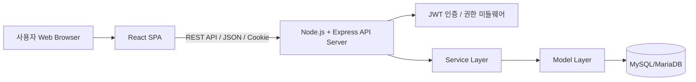
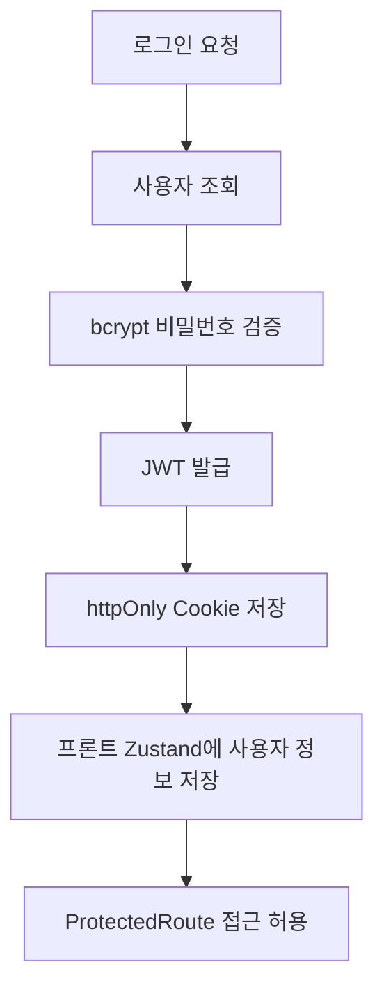
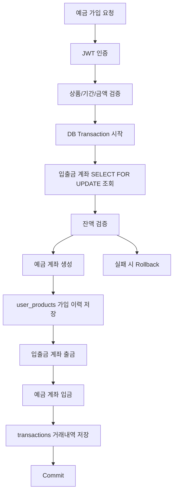
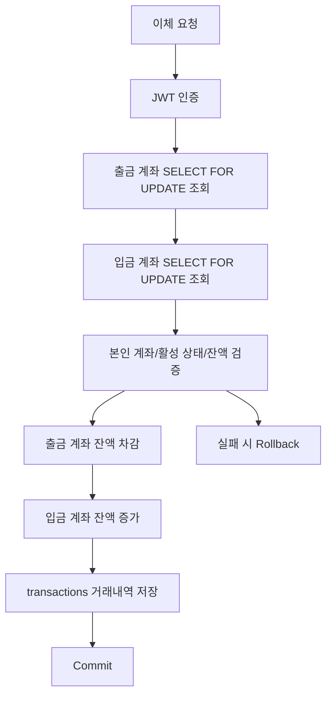

# 도토리뱅크 PPT 구성안

---

## 1. 표지

# 도토리뱅크

사회초년생을 위한 맞춤형 예금 추천 금융 플랫폼

- 팀명: 도토리뱅크
- 기간: 2026.05.08 - 2026.05.21
- 주요 기술: React, Node.js, Express, MySQL/MariaDB, JWT, React Query, Zustand

발표 핵심 메시지:

> 도토리뱅크는 사회초년생의 금융상품 선택 부담을 줄이기 위해 예금 추천부터 가입, 잔액 이동, 거래내역 저장까지 연결한 금융 MVP입니다.

---

## 2. 프로젝트 개요

### 주제

경제적으로 어려움을 겪는 사회초년생을 위해 소비·저축 데이터를 기반으로 맞춤형 금융상품 추천과 올바른 금융 습관 형성을 돕는 금융 플랫폼입니다.

### 서비스명

도토리뱅크

### 의미

작은 도토리가 큰 나무로 성장하듯, 사용자의 작은 자산도 체계적으로 관리하여 안정적인 미래 자산 형성을 지원합니다.

### 핵심 방향

- 사회초년생의 금융상품 선택 부담 완화
- 사용자 상황에 맞는 예금 상품 추천
- 추천 이후 실제 가입과 거래내역 저장까지 이어지는 금융 흐름 구현

---

## 3. 선정 배경 및 문제 정의

### 문제 정의

사회초년생은 금융상품을 선택할 때 다음과 같은 어려움을 겪습니다.

- 금리, 기간, 최소 가입 금액을 한 번에 비교하기 어렵다.
- 자신의 소득, 보유 금액, 저축 목적에 맞는 상품을 판단하기 어렵다.
- 추천 결과가 왜 나왔는지 이해하기 어렵다.
- 금융 서비스에서는 단순 기능보다 신뢰성과 데이터 정합성이 중요하다.

### 출발 질문

- 사회초년생은 금융 상품을 고를 때 어떤 어려움을 겪는가?
- 그 어려움을 해결하기 위해 어떤 기능이 필요한가?
- 그 기능을 구현하려면 어떤 기술이 적합한가?

### 차별점

기존 금융 플랫폼이 전체 사용자 대상 상품 탐색에 가깝다면, 도토리뱅크는 사회초년생의 소득, 보유 금액, 저축 목적, 선호 성향을 기준으로 보다 맞춤형 예금 상품을 추천합니다.

---

## 4. MVP 범위와 기획 의도

### MVP 범위 결정

짧은 프로젝트 기간 안에 모든 금융상품을 구현하기보다, 초기 버전에서는 예금 추천과 가입 흐름에 집중했습니다.

### 이유

- 금융 서비스는 기능 수보다 신뢰성이 중요하다.
- 추천 이후 실제 가입, 잔액 이동, 거래내역 저장까지 연결되는 흐름이 핵심이다.
- MVP 단계에서는 하나의 금융 플로우를 끝까지 구현하는 것이 더 의미 있다고 판단했다.

발표 멘트:

> 처음에는 더 넓은 금융 플랫폼을 생각했지만, 금융 서비스는 신뢰성이 중요한 도메인이라고 판단했습니다. 그래서 초기 MVP에서는 예금 추천과 가입 흐름에 집중했고, 추천 이후 잔액 이동과 거래내역 저장까지 연결되는 완결된 금융 플로우를 먼저 검증했습니다.

---

## 5. 프로젝트 주요 구현 범위

### 사용자 기능

- 회원가입
- 로그인 / 로그아웃
- JWT 쿠키 기반 인증
- 계좌 조회
- 거래내역 조회
- 이체
- 예금 상품 목록 조회
- 예금 상품 상세 조회
- 추천 설문 응답
- 맞춤 예금 상품 추천
- 예금 가입
- 예금 해지

### 관리자 기능

- 관리자 페이지
- 전체 계좌 조회
- 전체 거래내역 조회
- 계좌 활성/비활성 상태 변경
- 관리자 권한 검증

### 문서화

- Swagger 기반 API 문서 구성

---

## 6. 기술 스택

### Frontend

- React
- Vite
- React Router
- React Query
- Zustand
- CSS Modules

### Backend

- Node.js
- Express
- JWT
- bcrypt
- cookie-parser
- cors
- Swagger

### Database

- MySQL/MariaDB
- mysql2
- 주요 테이블: users, accounts, products, interests, user_products, transactions

### Tools

- VS Code
- GitHub
- Figma
- ERDCloud
- GCP VM
- AI 도구

---

## 7. 팀 구성 및 역할

| 이름 | 역할 | 담당 |
|---|---|---|
| 주문국 | 팀장 | Figma, 기획 및 화면 설계 |
| 한이슬 | 팀원 | React 기반 화면 구현, Node.js 서버 구현 |
| 박지원 | 부팀장 | Node.js 서버 구현, GCP 배포, 발표 |
| 이민주 | 팀원 | Figma, React 기반 화면 구현 |
| 공통 | 공통 | 기획, DB 설계, 기능 흐름 정리 |

---

## 8. 프로젝트 수행 절차

| 구분 | 기간 | 활동 | 비고 |
|---|---|---|---|
| 사전 기획 | 4월 29일 - 5월 1일 | 프로젝트 기획 및 주제 선정, 요구사항 분석 및 기능 정의 | 주제 선정 |
| 화면 및 기능 설계 | 5월 2일 - 5월 7일 | 사용자 및 관리자 화면 구성 설계, 메뉴 구조 및 기능 흐름 정리 | Figma 기반 목업 |
| DB 설계 | 5월 6일 - 5월 10일 | 테이블 설계, 컬럼 정의 및 관계 구조 정리 | ERDCloud 기반 |
| 백엔드 구현 | 5월 11일 - 5월 18일 | Express 서버 구현, REST API 및 JWT 인증 처리 | 기능 구현 |
| 프론트엔드 구현 | 5월 11일 - 5월 18일 | React 화면 구현, 상태 관리 및 API 연동 | 기능 구현 및 API 연결 |
| 통합 테스트 및 수정 | 5월 19일 - 5월 20일 | GCP VM 배포, 오류 수정, 예외 처리 보완 | 오류 검증 |
| 배포 및 시연 준비 | 5월 20일 - 5월 21일 | 성능평가, 보고서, PPT, 시연영상 제작 | 최종 점검 |

---

## 9. 전체 서비스 아키텍처

### 전체 흐름



### 구조 설명

- 사용자는 브라우저에서 React SPA 화면을 이용합니다.
- 프론트엔드는 REST API를 통해 Express 서버와 통신합니다.
- 로그인 후 JWT가 httpOnly Cookie에 저장됩니다.
- 백엔드는 인증/권한 검증 후 서비스 로직을 수행합니다.
- DB에는 사용자, 계좌, 상품, 금리, 가입 상품, 거래내역이 저장됩니다.

---

## 10. 프론트엔드 구조

### React SPA

프론트엔드는 React SPA로 구현했습니다.

### 주요 화면

- 로그인 / 회원가입
- 계좌 조회
- 거래내역 조회
- 이체
- 예금 상품 목록
- 예금 상품 상세
- 추천 설문
- 추천 결과
- 예금 가입
- 관리자 페이지

### 상태 관리 기준

- React Query: 계좌, 거래내역, 상품 상세 등 서버 상태 관리
- Zustand: 로그인 사용자 정보, 인증 확인 여부, 메뉴 상태 관리
- useState: 폼 입력값, 설문 선택값, 모달 상태 관리

발표 멘트:

> 프론트에서는 서버에서 가져오는 계좌와 상품 데이터는 React Query로 관리했고, 로그인 사용자와 인증 체크 여부는 Zustand로 분리했습니다. 금융 서비스에서는 인증 여부에 따라 접근 가능한 화면이 달라지기 때문에 ProtectedRoute를 통해 계좌, 이체, 예금 가입 페이지를 보호했습니다.

---

## 11. 백엔드 구조

### Node.js + Express API Server

백엔드는 Express 기반 REST API 서버로 구현했습니다.

### 계층 구조

- routes: API 엔드포인트 정의
- controllers: 요청/응답 처리
- services: 비즈니스 로직 처리
- models: DB 쿼리 처리
- middlewares: 인증/권한 검증

### 주요 API

- /api/user
- /api/accounts
- /api/transfer
- /api/deposits
- /api/products
- /api/recommend
- /api/transactions
- /api/admin

발표 멘트:

> 백엔드는 라우터, 컨트롤러, 서비스, 모델 계층으로 나누어 역할을 분리했습니다. 컨트롤러는 요청 검증과 응답을 담당하고, 서비스는 이체나 예금 가입 같은 비즈니스 흐름을 처리하며, 모델은 DB 쿼리를 담당하도록 구성했습니다.

---

## 12. 인증 및 권한 처리

### JWT + httpOnly Cookie

로그인 성공 시 JWT를 발급하고 httpOnly Cookie에 저장합니다.

### 인증 흐름



### 백엔드 미들웨어

- authMiddleware: Cookie token 확인, JWT 검증, req.user 저장
- authorizeMiddleware: role 기반 관리자 권한 확인

### 프론트 처리

- 앱 진입 시 /api/user/verify 요청
- 인증 확인 전 보호 페이지 렌더링 대기
- 미로그인 사용자는 로그인 페이지로 이동

---

## 13. DB 설계

### 주요 테이블

| 테이블 | 설명 |
|---|---|
| users | 사용자 계정, 권한, 생년월일 |
| accounts | 계좌번호, 계좌 타입, 잔액, 활성 상태 |
| products | 예금/적금/입출금 상품 기본 정보 |
| interests | 상품별 기간, 금리, 중도해지 금리 |
| user_products | 사용자가 가입한 상품 이력 |
| transactions | 이체/예금가입/해지 거래 기록 |

### 설계 의도

- 사용자와 계좌는 1:N 관계
- 상품과 금리는 1:N 관계
- 사용자가 가입한 상품은 user_products에 저장
- 돈의 이동은 transactions에 기록

발표 멘트:

> 계좌, 사용자, 상품, 가입 이력, 거래내역은 관계가 명확한 데이터입니다. 특히 거래내역과 상품 가입 이력은 join과 트랜잭션이 중요하기 때문에 관계형 DB가 적합하다고 판단했습니다.

---

## 14. 추천 로직 설계

### 추천 방식 후보

- KT LLM 믿음 기반 RAG
- 자체 설계 비즈니스 로직

### 최종 선택

MVP에서는 자체 비즈니스 로직 기반 추천을 선택했습니다.

### 선택 이유

- 금융상품 추천은 설명 가능성이 중요하다.
- MVP 단계에서는 추천 결과를 통제하고 디버깅하기 쉬워야 한다.
- 사용자의 입력값과 상품 조건을 기준으로 추천 근거를 설명할 수 있다.

### 추천 기준

- 소득 구간
- 보유 금액 구간
- 저축 목적
- 가입 기간
- 선호 성향
- 상품 금리
- 상품 최소 가입 금액

---

## 15. 추천 상품 요청 흐름

```mermaid
flowchart TD
  A[추천 설문 응답] --> B[/api/recommend/deposits]
  B --> C[입력값 서버 검증]
  C --> D[기간에 맞는 예금 상품 조회]
  D --> E[보유 금액 기준 가입 불가 상품 제외]
  E --> F[금리 점수 계산]
  F --> G[소득/목표/성향 가중치 적용]
  G --> H[최종 점수 정렬]
  H --> I[Top 3 추천 반환]
```

발표 멘트:

> 추천 로직은 LLM/RAG도 고민했지만, 초기 MVP에서는 설명 가능한 룰 기반 추천을 선택했습니다. 금융상품 추천은 사용자가 왜 이 상품을 추천받았는지 납득할 수 있어야 한다고 봤고, 그래서 소득, 보유 금액, 저축 목적, 기간, 성향을 점수화하는 방식으로 구현했습니다.

---

## 16. 예금 가입 요청 흐름



### 핵심 포인트

- 프론트 검증만 믿지 않고 서버에서 상품/기간/금액을 다시 검증
- 입출금 계좌를 SELECT ... FOR UPDATE로 조회
- 잔액 부족 시 가입 실패
- 예금 계좌 생성, 가입 이력 저장, 잔액 이동, 거래내역 저장을 하나의 트랜잭션으로 처리
- 중간 실패 시 rollback

발표 멘트:

> 예금 가입은 단순히 상품을 선택하는 기능이 아니라 돈이 이동하는 흐름입니다. 그래서 예금 계좌 생성, 가입 이력 저장, 입출금 계좌 출금, 예금 계좌 입금, 거래내역 저장을 하나의 DB 트랜잭션으로 묶었습니다.

---

## 17. 이체 요청 흐름



### 핵심 포인트

- 인증된 사용자만 이체 가능
- 본인 출금 계좌 여부 확인
- 동일 계좌 이체 방지
- 잔액 부족 검증
- 출금/입금/거래내역 저장을 하나의 트랜잭션으로 처리

---

## 18. 금융 서비스 신뢰성 처리

### 신뢰성이 필요한 이유

금융 서비스에서는 화면이 잘 보이는 것만큼, 데이터가 정확하고 추적 가능해야 합니다.

### 구현한 신뢰성 요소

- 서버 검증
- DB Transaction
- SELECT ... FOR UPDATE
- 잔액 검증
- Commit / Rollback
- 거래내역 저장
- JWT 인증
- 관리자 권한 검증

### 설명

- 서버 검증: 프론트 입력값을 신뢰하지 않고 백엔드에서 최종 검증
- DB Transaction: 여러 DB 작업을 하나의 단위로 처리
- SELECT ... FOR UPDATE: 같은 계좌에 대한 동시 요청 시 row lock 적용
- 잔액 검증: 최신 DB 잔액 기준으로 검증
- Commit / Rollback: 모든 작업 성공 시 확정, 실패 시 되돌림
- 거래내역 저장: 잔액 변경의 근거를 추적 가능하게 저장

발표 멘트:

> 신뢰성 측면에서는 프론트 입력을 믿지 않고 서버에서 다시 검증했습니다. 돈이 이동하는 이체와 예금 가입은 DB 트랜잭션으로 묶었고, 계좌 row를 FOR UPDATE로 잠가 동시에 요청이 들어와도 잔액이 꼬이지 않도록 고려했습니다.

---

## 19. 병목 처리 및 확장 방향

### 현재 구조

현재 MVP는 메시지 큐 없이 동기 트랜잭션 기반으로 처리했습니다.

### 병목이 발생할 수 있는 지점

- API 서버 요청 증가
- DB 커넥션 증가
- 거래내역 조회 데이터 증가
- 같은 계좌에 대한 동시 거래 요청
- 알림/감사 로그/통계 등 후처리 작업 증가

### 대응 방향

- API 서버 수평 확장 및 로드밸런서 적용
- DB connection pool 조정
- 거래내역/관리자 조회 API 페이지네이션 적용
- 조회 조건에 맞는 인덱스 설계
- 상품 목록/금리 정보 등 자주 바뀌지 않는 데이터 캐싱
- 핵심 거래 이후 후처리 작업은 메시지 큐로 분리

발표 멘트:

> 현재 서비스에는 메시지 큐를 반영하지 않았습니다. 다만 병목이 발생한다면 이체나 예금 가입처럼 정합성이 중요한 핵심 거래는 동기 트랜잭션으로 유지하고, 알림 발송, 감사 로그 저장, 이상거래 탐지, 통계 집계 같은 후처리는 메시지 큐로 분리할 수 있다고 생각합니다. 조회성 병목은 페이지네이션과 인덱스로 대응하겠습니다.

---

## 20. 테스트 및 개선

### 통합 테스트 관점

- 회원가입 후 기본 입출금 계좌 생성 확인
- 로그인 후 JWT 쿠키 인증 확인
- 보호 라우트 접근 제어 확인
- 계좌 조회 API 연동 확인
- 예금 상품 목록/상세 조회 확인
- 추천 설문 후 추천 상품 반환 확인
- 예금 가입 시 잔액 이동 및 거래내역 저장 확인
- 이체 시 출금/입금 계좌 잔액 변경 확인
- 관리자 계정 권한 검증 확인

### 확인된 개선 필요 사항

- 테스트 코드 추가 필요
- React Query mutation 이후 query invalidation 전략 보완 필요
- README 및 문서 인코딩 정리 필요
- 운영 환경 보안 설정 강화 필요
- 중복 요청 방지와 멱등성 처리 필요

---

## 21. 자체 평가

### 완성도 평가

사전 기획 대비 완성도: 8 / 10

### 잘한 점

- 짧은 기간과 적은 인원에도 MVP 흐름을 완성했다.
- 단순 화면 구현이 아니라 계좌, 거래, 예금 가입, 추천까지 연결했다.
- React Query와 Zustand를 사용해 서버 상태와 전역 상태를 분리했다.
- 백엔드에서 트랜잭션과 row lock을 사용해 금융 데이터 정합성을 고려했다.
- Swagger 문서와 관리자 기능을 통해 API와 운영 관점을 일부 반영했다.

### 아쉬운 점

- 초기 기획에서 적금, 대출, 카드까지 포함하고 싶었지만 예금 중심으로 범위를 줄였다.
- RAG 기반 금융상품 추천을 구현하고 싶었지만, MVP에서는 룰 기반 매핑/점수화 로직으로 대체했다.
- TypeScript를 사용해 더 구조화된 타입 기반 개발을 해보고 싶었지만, 이번에는 코드 흐름 이해와 기능 구현에 집중했다.
- 테스트 코드, 멱등성 처리, 운영 보안 설정은 아직 부족하다.

---

## 22. 프론트엔드에서 배운 점

### 배운 점

- 컴포넌트 구조화를 기반으로 React 화면을 설계해볼 수 있었다.
- React Query를 통해 서버 상태를 관리하고 캐싱할 수 있었다.
- Zustand를 통해 로그인 사용자 정보와 인증 확인 여부를 전역 상태로 관리할 수 있었다.
- ProtectedRoute를 통해 인증 상태와 라우팅을 연결할 수 있었다.
- 폼 상태, 서버 상태, 전역 상태의 역할을 구분하는 기준을 배웠다.

### 개선 방향

- 이체/예금 가입 성공 후 accounts, transactions query invalidation 추가
- 공통 API 에러 처리 구조화
- TypeScript 도입
- 접근성 및 입력 검증 UX 개선
- 중복 fetch 로직 정리

---

## 23. 백엔드에서 배운 점

### 배운 점

- Express에서 routes, controllers, services, models 계층을 나누어 API를 설계해볼 수 있었다.
- JWT와 httpOnly Cookie를 사용해 인증 흐름을 구현했다.
- bcrypt를 사용해 비밀번호를 해시 처리했다.
- 이체와 예금 가입처럼 돈이 움직이는 기능은 트랜잭션으로 묶어야 한다는 점을 배웠다.
- SELECT ... FOR UPDATE를 통해 같은 계좌에 대한 동시 요청을 제어하는 방식을 학습했다.
- 거래내역 저장을 통해 잔액 변경의 근거를 남기는 구조를 구현했다.

### 개선 방향

- 서비스 단위 테스트와 API 통합 테스트 작성
- 멱등성 키를 통한 중복 요청 방지
- 운영 환경 cookie secure 설정
- CSRF, rate limit 보완
- 감사 로그와 이상거래 탐지 구조 추가
- 메시지 큐 기반 후처리 구조 도입 검토

---

## 24. 활용 방안 및 기대 효과

### 사용자 관점

- 사회초년생이 자신의 금융 상황에 맞는 예금 상품을 더 쉽게 선택할 수 있다.
- 추천 설문을 통해 금융상품 선택 기준을 자연스럽게 학습할 수 있다.
- 가입 후 계좌와 거래내역을 통해 자산 흐름을 확인할 수 있다.

### 서비스 확장성

- 현재는 입출금과 예금 중심 MVP
- 추후 적금, 대출, 카드 상품 추가 가능
- 사용자 신용도 평가 기능 추가 가능
- RAG 기반 상품 설명/약관 요약/비교 기능 추가 가능
- 감사 로그, 이상거래 탐지, 알림 시스템 등 운영 기능 확장 가능

---

## 25. 향후 개선 계획

### 기능 개선

- 적금 상품 추가
- 대출 상품 추가
- 카드 상품 추가
- 신용도 평가 기능 추가
- 소비 데이터 기반 추천 고도화
- 상품 비교 기능 추가

### 기술 개선

- TypeScript 도입
- 테스트 코드 작성
- React Query invalidation 전략 정리
- 메시지 큐 기반 후처리 구조 도입
- 운영 보안 강화
- 성능 테스트 및 병목 분석
- 로깅/모니터링 시스템 구축

### 금융 신뢰성 개선

- 멱등성 키 기반 중복 요청 방지
- 감사 로그 테이블 추가
- 이상거래 탐지 로직 추가
- 관리자 모니터링 강화
- 거래 알림 기능 추가

---

## 26. 마무리

도토리뱅크를 만들면서 금융 서비스는 단순히 기능을 많이 붙이는 것보다 신뢰의 기준을 세우는 것이 중요하다고 느꼈습니다.

이번 MVP에서는 추천은 설명 가능하게, 거래는 트랜잭션으로, 접근은 인증 기반으로, 검증은 서버 중심으로 설계하려고 했습니다.

아직 실제 금융 서비스 수준의 완성도는 아니지만, 금융 플랫폼에서 어떤 부분을 깊게 봐야 하는지 배운 프로젝트였습니다.

마무리 멘트:

> 도토리뱅크는 작은 자산을 관리하는 서비스라는 컨셉에서 출발했지만, 개발 과정에서는 금융 서비스의 신뢰성과 데이터 정합성을 가장 중요하게 고민했습니다. 앞으로는 상품 확장, 보안 강화, 테스트, 모니터링을 보완해 더 안정적인 금융 플랫폼으로 발전시키고 싶습니다.

