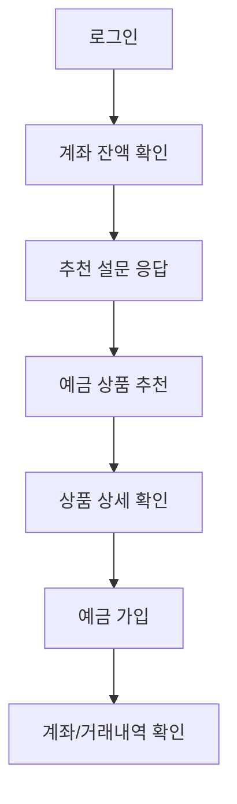
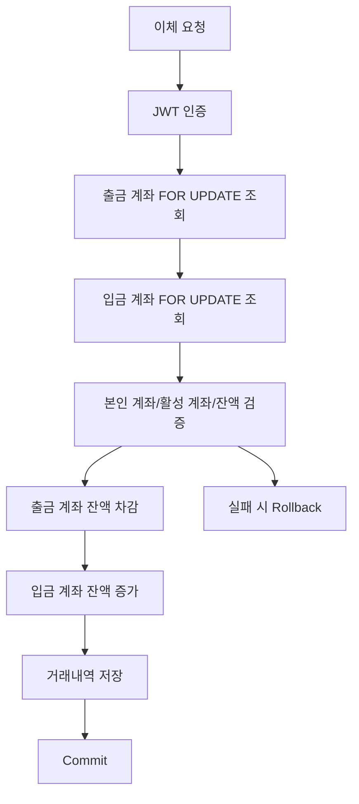
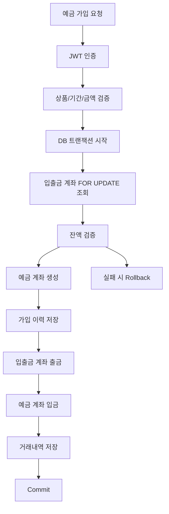

# 도토리뱅크 발표 초안

## 1. 발표 핵심 메시지

도토리뱅크는 사회초년생의 금융상품 선택 부담을 줄이기 위해 시작한 금융 플랫폼입니다.

처음에는 적금, 대출, 카드, 신용평가까지 포함한 넓은 금융 플랫폼을 상상했지만, 초기 MVP에서는 범위를 예금으로 줄였습니다. 금융 서비스에서 중요한 것은 기능을 많이 붙이는 것보다, 사용자가 추천받은 상품에 실제로 가입하고 잔액이 이동하며 거래내역이 남는 흐름을 신뢰성 있게 만드는 것이라고 판단했기 때문입니다.

발표의 중심 문장:

> 도토리뱅크는 예쁜 금융 화면을 만든 프로젝트가 아니라, 추천받은 예금 상품에 실제로 가입하고, 잔액이 이동하고, 거래내역이 남는 금융 MVP 흐름을 구현한 프로젝트입니다.

## 2. 문제 정의

사회초년생은 금융상품을 선택할 때 다음과 같은 어려움을 겪습니다.

- 금리, 가입 기간, 최소 가입 금액을 한 번에 비교하기 어렵다.
- 자신의 소득, 보유 금액, 저축 목적에 맞는 상품을 판단하기 어렵다.
- 금융상품 추천 결과가 왜 나왔는지 이해하기 어렵다.

따라서 도토리뱅크는 다음 질문에서 출발했습니다.

- 사용자의 금융 상황과 목적에 맞는 예금 상품을 추천할 수 있는가?
- 추천 이후 실제 가입, 잔액 이동, 거래내역 저장까지 하나의 흐름으로 연결할 수 있는가?
- 금융 플랫폼에서 필요한 신뢰성을 MVP 수준에서 어떻게 구현할 수 있는가?

## 3. MVP 범위 결정

초기 기획은 종합 금융 플랫폼에 가까웠습니다.

- 입출금
- 예금
- 적금
- 대출
- 카드
- 신용도 평가
- LLM/RAG 기반 금융상품 추천

하지만 짧은 기간 안에 모든 기능을 구현하면 문제 검증보다 기능 나열이 될 가능성이 컸습니다. 그래서 MVP 범위를 예금 추천과 가입 흐름으로 줄였습니다.

MVP에서 집중한 범위:

- 회원가입/로그인
- 기본 입출금 계좌 생성
- 계좌 조회
- 이체
- 예금 상품 조회
- 설문 기반 예금 추천
- 예금 가입
- 예금 해지
- 거래내역 조회
- 관리자 계좌/거래 관리
- Swagger API 문서화

발표 멘트:

> 처음에는 더 넓은 금융 플랫폼을 생각했지만, 금융 서비스는 신뢰성이 중요한 도메인이라고 판단했습니다. 그래서 초기 MVP에서는 예금 추천과 가입 흐름에 집중했고, 추천 이후 잔액 이동과 거래내역 저장까지 연결되는 완결된 금융 플로우를 먼저 검증했습니다.

## 4. 데모 시나리오

데모는 기능을 많이 보여주기보다 한 명의 사용자 흐름으로 보여줍니다.

데모 설명:

> 사회초년생 사용자가 로그인한 뒤 현재 계좌 잔액을 확인합니다. 이후 소득, 보유 금액, 저축 목적, 기간, 성향을 입력하면 도토리뱅크가 예금 상품을 추천합니다. 사용자는 추천 상품의 상세 정보를 확인하고 예금에 가입합니다. 가입 이후에는 입출금 계좌에서 금액이 차감되고, 예금 계좌가 생성되며, 거래내역에 기록이 남습니다.

## 5. 추천 로직 의사결정

추천 로직 후보는 두 가지였습니다.

- KT LLM 믿음 기반 RAG
- 자체 설계 비즈니스 로직

최종적으로 MVP에서는 자체 비즈니스 로직을 선택했습니다.

이유:

- 금융상품 추천은 설명 가능성이 중요하다.
- MVP 단계에서는 결과를 통제하고 디버깅하기 쉬워야 한다.
- 사용자의 소득, 목적, 기간, 금액, 성향을 기준으로 점수화하면 추천 근거를 설명할 수 있다.
- LLM/RAG는 추후 상품 설명, 약관 요약, 비교 설명에 붙이는 것이 더 적합하다고 판단했다.

추천 로직 구성:

- 소득 구간
- 보유 금액 구간
- 저축 목적
- 가입 기간
- 선호 성향
- 상품 금리
- 상품 최소 가입 금액

발표 멘트:

> 추천 로직은 LLM/RAG도 고민했지만, 초기 MVP에서는 설명 가능한 룰 기반 추천을 선택했습니다. 금융상품 추천은 사용자가 왜 이 상품을 추천받았는지 납득할 수 있어야 한다고 봤고, 그래서 소득, 보유 금액, 저축 목적, 기간, 성향을 점수화하는 방식으로 구현했습니다.

## 6. 프론트엔드 어필 포인트

프론트엔드는 React SPA 구조로 구현했습니다.

주요 기술:

- React
- React Router
- React Query
- Zustand
- CSS Modules

상태 관리 기준:

- 서버 상태: React Query
- 인증/유저 전역 상태: Zustand
- 폼/선택 UI 상태: useState

구현 포인트:

- 계좌 정보와 상품 상세는 React Query로 조회
- 로그인 사용자와 인증 확인 여부는 Zustand로 관리
- 인증이 필요한 페이지는 ProtectedRoute로 보호
- 쿠키 기반 인증을 위해 API 요청에 credentials 포함
- 설문 응답 후 추천 결과 페이지로 연결

발표 멘트:

> 프론트에서는 서버에서 가져오는 계좌와 상품 데이터는 React Query로 관리했고, 로그인 사용자와 인증 체크 여부는 Zustand로 분리했습니다. 금융 서비스에서는 인증 여부에 따라 접근 가능한 화면이 달라지기 때문에 ProtectedRoute를 통해 계좌, 이체, 예금 가입 페이지를 보호했습니다.

React SPA + Express API를 선택한 이유:

- 대부분의 핵심 화면이 로그인 이후 개인화 화면이다.
- SEO보다 사용자 흐름과 API 기반 개발 속도가 중요했다.
- 화면과 금융 로직의 책임을 명확히 분리할 수 있었다.
- 프론트는 사용자 경험과 상태 관리에 집중하고, 백엔드는 인증/검증/트랜잭션에 집중할 수 있었다.

Next.js 질문 대응:

> Next.js를 사용하더라도 금융 데이터의 정합성은 충분히 보장할 수 있습니다. 다만 그 정합성은 Next.js 자체가 보장하는 것이 아니라, 백엔드 트랜잭션, DB 잠금, 서버 검증으로 보장해야 한다고 봤습니다. 이번 MVP에서는 핵심 화면이 대부분 로그인 이후 개인화 화면이었고, SSR/SSG/SEO보다 금융 거래 흐름을 빠르게 완성하는 것이 우선이었습니다. 그래서 React SPA와 Express API로 역할을 단순하게 분리하고, 백엔드에서 정합성을 책임지는 구조를 선택했습니다.

React Query 캐싱 질문 대응:

> 계좌 잔액 조회에는 React Query를 사용했습니다. 다만 프론트 캐시는 UX를 위한 서버 상태 관리 도구이고, 최종 정합성의 기준은 백엔드와 DB입니다. 개선한다면 이체나 예금 가입 성공 후 accounts, transactions 쿼리를 명시적으로 invalidate해서 최신 데이터로 갱신하겠습니다.

## 7. 백엔드 어필 포인트

백엔드는 Express API와 MySQL 기반으로 구현했습니다.

주요 기술:

- Node.js
- Express
- MySQL
- JWT
- bcrypt
- cookie-parser
- Swagger

핵심 포인트는 금융 거래의 정합성입니다.

이체 흐름:

예금 가입 흐름:

발표 멘트:

> 이체와 예금 가입은 단순 CRUD가 아니라 돈이 이동하는 흐름이라고 봤습니다. 그래서 출금, 입금, 거래내역 저장을 하나의 DB 트랜잭션으로 묶었고, 중간에 실패하면 rollback되도록 구현했습니다. 또한 계좌 조회에 FOR UPDATE를 사용해서 동시에 요청이 들어왔을 때 잔액 정합성이 깨지지 않도록 고려했습니다.

MySQL 선택 이유:

> 계좌, 사용자, 상품, 가입 이력, 거래내역은 관계가 명확한 데이터입니다. 특히 거래내역과 상품 가입 이력은 join과 트랜잭션이 중요하기 때문에 관계형 DB가 적합하다고 판단했습니다.

Express 선택 이유:

> MVP 단계에서 프론트와 빠르게 API를 연결하고, 라우터/컨트롤러/서비스/모델 계층을 명확히 나누기 위해 Express를 선택했습니다.

## 8. 신뢰성 관점에서 본 구현

도토리뱅크에서 신뢰성이 필요한 지점:

- 인증된 사용자만 계좌와 거래내역에 접근해야 한다.
- 이체나 예금 가입 중 일부 단계만 성공하면 안 된다.
- 잔액은 항상 최신 DB 상태를 기준으로 검증되어야 한다.
- 거래가 발생하면 추적 가능한 이력이 남아야 한다.
- 추천 결과는 사용자가 납득할 수 있어야 한다.

구현으로 대응한 방식:

- JWT + httpOnly cookie 기반 인증
- ProtectedRoute와 authMiddleware
- role 기반 관리자 권한 분리
- 서버 검증
- DB transaction
- SELECT ... FOR UPDATE
- 거래내역 저장
- 룰 기반 추천 점수화

발표 멘트:

> 실제 금융 서비스 수준이라고 말하기는 어렵지만, 금융 플랫폼에서 신뢰성이 필요한 지점을 먼저 식별했습니다. 이번 MVP에서는 인증, 서버 검증, 트랜잭션, row lock, 거래 이력 저장을 통해 기본적인 신뢰성 구조를 잡는 데 집중했습니다.

## 9. 시행착오와 배운 점

시행착오:

- 처음에는 종합 금융 플랫폼을 만들고 싶었지만 범위가 너무 커져 예금 MVP로 줄였다.
- LLM/RAG 기반 추천을 고민했지만 설명 가능성과 통제 가능성을 위해 룰 기반 추천을 먼저 선택했다.
- 프론트 검증만으로는 금융 서비스 신뢰성을 보장할 수 없어서 서버 검증을 추가했다.
- 단순 잔액 업데이트로는 위험하다고 판단해 트랜잭션과 row lock을 적용했다.
- 서버 상태와 전역 상태의 성격이 달라 React Query와 Zustand로 분리했다.

배운 점:

- 기술 스택은 많이 쓰는 것보다 왜 필요한지 설명할 수 있어야 한다.
- 금융 서비스에서는 기능 구현보다 데이터 정합성과 검증 기준이 중요하다.
- AI를 사용하더라도 도메인 판단과 최종 책임은 개발자가 가져야 한다.
- MVP는 기능을 줄이는 것이 아니라, 검증할 핵심 흐름을 선명하게 만드는 과정이다.

AI 사용 질문 대응:

> AI를 사용하면서 구현 속도는 빨라졌지만, 금융 도메인에서는 AI가 만든 코드를 그대로 믿으면 위험하다고 느꼈습니다. 그래서 트랜잭션이 보장되는지, 서버 검증이 있는지, 인증된 사용자만 접근하는지 같은 기준으로 다시 확인했습니다. AI는 구현 보조 도구로 쓰되, 도메인 판단과 최종 책임은 개발자가 가져야 한다고 느꼈습니다.

## 10. 한계와 개선 방향

현재 한계:

- 테스트 코드가 아직 부족하다.
- 프론트 빌드 과정에서 server/static 복사 권한 이슈가 발생했다.
- README와 문서 인코딩 정리가 필요하다.
- React Query invalidation 전략이 더 명확해야 한다.
- 운영 수준의 보안은 아직 부족하다.
- 멱등성 키, 중복 요청 방지, 감사 로그, 이상 거래 탐지는 아직 없다.

개선 방향:

- 이체/예금 가입 성공 후 accounts, transactions query invalidation 추가
- 예금 가입/이체 서비스 테스트 작성
- 운영 환경 cookie secure 설정
- CSRF, rate limit, 요청 중복 방지 보완
- 감사 로그와 관리자 모니터링 강화
- 적금, 대출, 카드 상품 확장
- 신용도 평가 추가
- RAG 기반 상품 설명/약관 요약/비교 기능 도입

발표 멘트:

> 아직 실제 금융 서비스 수준의 완성도는 아닙니다. 테스트, 멱등성, 중복 요청 방지, 운영 보안, 감사 로그 같은 부분은 부족합니다. 다만 이번 프로젝트를 통해 금융 플랫폼에서 어떤 지점에 신뢰성이 필요한지 알게 되었고, MVP 수준에서 트랜잭션과 검증 중심으로 구조를 잡아본 것이 가장 큰 학습이었습니다.

## 11. 예상 질문과 답변

### Q. pain point가 약한 것 아닌가요?

A. 단일한 강한 pain point보다는 사회초년생의 금융상품 선택 부담과 정보 비대칭을 문제로 봤습니다. 다만 개발 과정에서는 추천 기능 자체보다 추천 이후 실제 가입, 잔액 이동, 거래내역 저장까지 이어지는 신뢰 가능한 금융 흐름을 MVP로 검증하는 데 집중했습니다.

### Q. 왜 Next.js가 아니라 React SPA를 사용했나요?

A. Next.js를 사용해도 백엔드 트랜잭션과 DB 잠금을 통해 금융 데이터 정합성을 보장할 수 있습니다. 다만 이번 프로젝트에서 Next.js의 SSR, SSG, SEO 장점이 핵심 요구사항은 아니었습니다. 도토리뱅크의 핵심 화면은 대부분 로그인 이후 사용자별 데이터 화면이었고, 짧은 MVP 기간에는 API 기반 개발 속도와 역할 분리가 더 중요했습니다. 그래서 React SPA는 화면과 사용자 흐름을 담당하고, Express API는 인증, 검증, 트랜잭션을 담당하도록 나눴습니다.

### Q. React Query 캐싱 때문에 잔액이 오래될 수 있지 않나요?

A. 맞습니다. React Query 캐시는 UX를 위한 서버 상태 관리 도구이고, 금융 데이터의 최종 정합성은 백엔드와 DB가 기준입니다. 개선한다면 이체나 예금 가입 같은 mutation 이후 accounts, transactions 쿼리를 invalidate해서 최신 데이터를 다시 가져오도록 보완하겠습니다.

### Q. 왜 LLM/RAG 추천을 사용하지 않았나요?

A. 금융상품 추천은 설명 가능성이 중요하다고 봤습니다. MVP 단계에서는 추천 결과를 통제하고 디버깅하기 쉬운 룰 기반 로직이 더 적합하다고 판단했습니다. RAG는 추후 상품 설명, 약관 요약, 상품 비교처럼 설명을 보강하는 영역에 적용하는 것이 더 적합하다고 봤습니다.

### Q. 금융 서비스라고 하기엔 보안이 부족하지 않나요?

A. 맞습니다. 실제 금융 서비스 수준에는 아직 부족합니다. 이번 MVP에서는 JWT httpOnly cookie, 서버 검증, 권한 분리, 트랜잭션, 거래내역 저장처럼 기본 구조를 잡는 데 집중했습니다. 운영 수준으로 가려면 secure cookie, CSRF, rate limit, 멱등성, 감사 로그, 이상 거래 탐지가 추가되어야 합니다.

### Q. 가장 기술적으로 깊게 고민한 부분은 무엇인가요?

A. 이체와 예금 가입의 거래 정합성입니다. 출금, 입금, 거래내역 저장 중 일부만 성공하면 안 되기 때문에 DB 트랜잭션으로 묶었고, 계좌 row를 FOR UPDATE로 잠가 동시 요청 상황에서 잔액이 꼬이지 않도록 고려했습니다.

## 12. 최종 마무리 멘트

> 도토리뱅크를 만들면서 금융 서비스는 기능을 많이 붙이는 것보다 신뢰의 기준을 세우는 것이 중요하다고 느꼈습니다. 이번 MVP에서는 추천은 설명 가능하게, 거래는 트랜잭션으로, 접근은 인증 기반으로, 검증은 서버 중심으로 설계하려고 했습니다. 아직 부족한 점은 많지만, 금융 플랫폼에서 어떤 부분을 깊게 봐야 하는지 배운 프로젝트였습니다.
